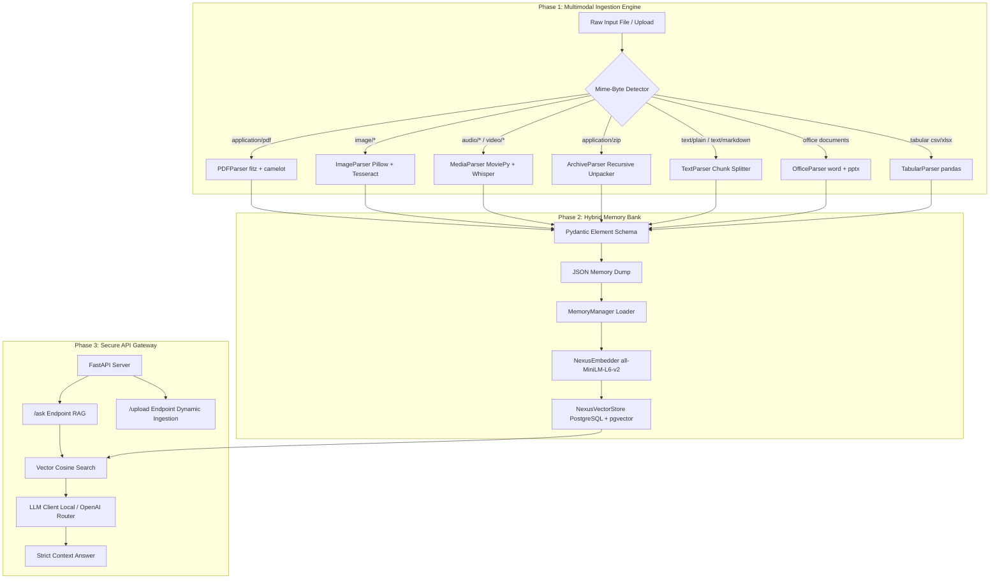

# 🌌 Nexus_AI: Project Status & Comprehensive Architectural Walkthrough
### *The Agentic Unstructured-to-Action Intelligence Engine (Production Status Report)*

This document serves as the absolute, complete, and un-truncated source of truth for **Nexus_AI**. It contains a detailed breakdown of every single file, module, parser, database schema, API endpoint, and engineering decision implemented so far. 

Use this report to instantly align your AI assistant in **Google AI Studio** with the exact state of the project, including technical trade-offs, file paths, structural schemas, and future roadmap phases.

---

## 🗺️ High-Level System Architecture

Nexus_AI is built as a highly modular, decoupled enterprise AI pipeline. Below is the workflow of data from raw file upload to generative retrieval:



---

## 🧬 Module 1: The Multimodal Ingestion Engine (The Senses)
The Senses module functions as a **"Universal Translator"** for unstructured data. Rather than trusting unreliable file extensions, it performs raw binary analysis and dynamically routes files to optimized extraction sub-engines.

### 1. Unified Dispatcher (`src/ingestion/dispatcher.py`)
- **Binary Magic-Byte Detection:** Uses the `python-magic` C-library binding to inspect binary headers of incoming streams. If a user renames an `.mp4` file to `.pdf`, the system correctly flags it as video and parses it using Whisper.
- **Async Concurrency Limiter:** Processes file ingestion asynchronously, controlled by a strict `asyncio.Semaphore(5)` throttle. This guarantees the server will never run out of memory or crash when receiving a massive batch of files concurrently.
- **Recursive Archive Ingest:** Intercepts ZIP directories unpacked by the Archive Parser, extracts individual files, and feeds them back into the dispatcher recursively.

### 2. High-Performance Format Parsers (`src/ingestion/parsers/`)

#### 📄 PDF Parser (`pdf_parser.py`)
* **The Technical Challenge:** Standard text extraction (like `pypdf`) strips table formatting into chaotic jumbled strings, destroying structural relationships that LLMs rely on.
* **The Engineering Solution:** Implemented a **Hybrid Extraction Model**. 
  - **Text:** `PyMuPDF (fitz)` extracts block-level text quickly.
  - **Tables:** `Camelot (stream flavor)` detects grid alignments and converts cell text into structured tables.
  - **Linearization:** Tables are converted to clean, pipe-separated (`|`) layouts before embedding, ensuring tabular coherence.

#### 🎙️ Media & Audio-Video Parser (`media_parser.py`)
* **The Technical Challenge:** Modern video formats contain heavy, multi-track audio codecs that cause severe memory consumption and CPU lockup when loaded directly into memory.
* **The Engineering Solution:** Built an extraction pipeline:
  - **Audio Extraction:** `MoviePy` extracts the raw audio stream from containers like `.mp4`, `.mkv`, `.mov`, `.avi` and writes them as normalized, lightweight temp `.wav` files.
  - **Speech-to-Text:** Implemented `OpenAI Whisper` (using the balanced `base` model locally).
  - **Timestamped Chunking:** Whisper transcribes the file and splits it into fine-grained segments. The parser captures segment timestamps (`start`, `end`) and indices, preserving conversational flow with precise metadata.

#### 👁️ Image OCR Parser (`image_parser.py`)
* **The Technical Challenge:** Poor resolution, scanner artifacts, and color gradients generate substantial noise, which severely degrades OCR transcription accuracy.
* **The Engineering Solution:** 
  - **Pre-processing:** Uses `Pillow (PIL)` and `ImageOps` to pre-process images. It converts the image into **grayscale (`L` mode)** to strip color channel noise.
  - **OCR Engine:** Feeds the normalized grayscale buffer into `pytesseract (Tesseract-OCR)` for layout-preserving text extraction.

#### 🗄️ Archive Parser (`archive_parser.py`)
* **The Technical Challenge:** Recursive folder structures, hidden system files (such as Mac `.DS_Store`), and dangerous "Zip-Bombs" designed to overflow disks during unzipping.
* **The Engineering Solution:**
  - **Unique Isolation:** Generates a secure, isolation directory in `data/temp/` using UUID-hex sub-folders, guaranteeing zero filename collisions.
  - **Zip-Slip Protection:** Explicitly leverages Python 3.12+'s strict `filter='data'` extraction security to block malicious directory traversal attacks (where files try to unpack outside the temp folder).
  - **Filter Guards:** Automatically strips out macOS junk files (`__MACOSX`, hidden `.*` files) and recursively lists clean files to feed the dispatcher stream.

#### 📊 Tabular Parser (`tabular_parser.py`)
* **The Technical Challenge:** Raw spreadsheets (.xlsx) and CSV files contain scattered information that becomes unreadable when flattened.
* **The Engineering Solution:** Uses `Pandas` to load datasets. It parses files dynamically as CSV, TSV, or XLSX, and converts the resulting DataFrame to a **pipe-separated (`|`) string** with `index=False`. This provides clear columns and margins that LLMs can parse with mathematical precision.

#### 🏢 Office Parser (`office_parser.py`)
* **The Technical Challenge:** Microsoft Word (`.docx`) and PowerPoint (`.pptx`) represent content inside highly complex, deeply nested XML files.
* **The Engineering Solution:** 
  - **Word:** Uses `python-docx` to extract text paragraph-by-paragraph, maintaining chunk boundaries.
  - **PowerPoint:** Uses `python-pptx` to traverse slides, extracting text frames shape-by-shape to capture tabular structures, slide titles, and bullet lists in correct layout sequence.

#### 📝 Text Parser (`text_parser.py`)
* **The Technical Challenge:** Sending huge text or markdown files as a single block ruins vector accuracy, because embedding models have token limits and average out semantic meaning.
* **The Engineering Solution:** Automatically splits files by double newlines (`\n\n`), segmenting documents into logical, semantic paragraphs.

### 3. Strict Schema Validation (`src/ingestion/schemas.py`)
Built on `Pydantic v2` to guarantee data integrity across parsers:
* **`DocumentElement`:** The unified schema representing every single piece of extracted data.
  * `element_type` (str): Categorizes content (e.g., `"text"`, `"table"`).
  * `content` (str): The raw text or linearized markdown string.
  * `source_file` (str): Tracks the file origin.
  * `page_number` (Optional[int]): Tracks coordinates for multi-page documents (PDFs).
  * `metadata` (Dict): Captures unique, format-specific details (e.g., media timestamps, image sizes, Excel sheet rows).
  * `processed_at` (datetime): Time of processing.
* **`IngestionResponse`:** A global schema wrapping the entire ingestion job. It includes metadata like total elements captured and file names processed, and outputs the resulting package as a deterministic `nexus_memory_dump.json`.

---

## 🧠 Module 2: The Hybrid Memory Bank (The Memory)
The Memory module acts as our high-performance vector search engine. It balances relational rigor (metadata filters) with semantic search capabilities.

### 1. Technology Choice: PostgreSQL + pgvector
We chose PostgreSQL 16 + pgvector over vector-only databases (like Pinecone or Milvus) for the following production reasons:
1. **ACID Compliance:** Guarantees absolute transactional safety and zero data corruption for corporate indexes.
2. **Unified Single-Query Filters:** Allows filtering by relational metadata (e.g., finding files uploaded on a certain date) and calculating vector similarity **in a single database query**, avoiding complex multi-database sync operations.
3. **No Vendor Lock-In:** Pure open-source vector search using standard PostgreSQL extensions.
4. **Performance:** Eliminates ORM latency by running optimized queries using direct cosine distance calculations.

### 2. SQLAlchemy ORM Model (`src/memory/models.py`)
* **Database Model (`NexusMemory`):** Maps python records to the PostgreSQL `nexus_memory` table.
* **pgvector Integration:** Features a native vector field column configured as `Vector(384)`, which perfectly matches the 384-dimensional dense vectors output by our embedding model.
* **JSONB Storage:** Stores element metadata in a `JSONB` column, enabling binary, indexed metadata lookups.
* **Strict Validation (`MemoryRecord`):** A Pydantic schema that enforces exactly 384 dimensions on floats before they hit the database, preventing pipeline injection errors.

### 3. Sentence Embedding Model (`src/memory/embedder.py`)
* Uses `SentenceTransformer("all-MiniLM-L6-v2")`, a highly optimized model that provides high-quality retrieval accuracy with sub-millisecond execution speeds.
* Features thread-safe batch encoding (`embed_batch`), allowing CPU-intensive AI vectorization to run efficiently alongside I/O tasks.

### 4. Vector Store Connection Pool (`src/memory/database.py`)
* **Asynchronous Execution:** Built using `create_async_engine` and `asyncpg` to perform database initialization, document indexing, and similarity queries without blocking the server.
* **Automatic Setup:** Safely executes `CREATE EXTENSION IF NOT EXISTS vector;` and syncs declarative tables upon startup.
* **Cosine Similarity Search:** Computes cosine distance (`cosine_distance` operator `<=>`) in raw SQL. It returns sorted results with similarity scores, matched sources, and metadata in milliseconds.

### 5. Memory Orchestration (`src/memory/manager.py`)
Acts as the central control room for data storage:
* Reads `nexus_memory_dump.json` output by Module 1.
* Batches records (batch size of 100 elements) to prevent system memory overload.
* Multi-threads embedding generation using `asyncio.to_thread` to prevent CPU-intensive AI model runs from blocking database writes.
* Saves the resulting vector records directly to PostgreSQL.

---

## 🔌 Module 3: Secure API Gateway & RAG Routing (The Interface)
The API Gateway functions as the public interface for the application, exposing ingestion pipelines and semantic question-answering capabilities through secure HTTP endpoints.

### 1. Asynchronous API Server (`src/api/server.py`)
Developed using **FastAPI** with async lifespan managers:
* **Lifespan Management:** Connects to PostgreSQL and initializes vector extensions as soon as the server boots.
* **Home Route (`/`):** A healthcheck endpoint verifying gateway status.
* **RAG Search Route (`/ask?question=...`):**
  1. Translates the user's question into a 384-dimension vector asynchronously.
  2. Queries pgvector in PostgreSQL to find the **top 2 closest context matches**.
  3. Routes the question along with the matches to the LLM client.
  4. Delivers the verified response and lists the files used as sources.
* **Direct Upload Route (`/upload`):**
  1. Saves incoming files securely to a temporary folder.
  2. Runs magic-byte checks and routes the file through the ingestion pipeline.
  3. Vectorizes the extracted text instantly.
  4. Saves the results to the database and cleans up temp files. This allows users to add new files to the system dynamically without restarting the pipeline.

### 2. Intelligent LLM Router (`src/api/llm.py`)
* **Local vs Cloud Routing:** Dynamically shifts processing based on settings in `.env`:
  - **Local:** Connects to local instances of LM Studio or Ollama (defaulting to `qwen2.5:3b` for fast, private processing).
  - **Cloud:** Connects to OpenAI APIs (defaulting to `gpt-4o-mini` for high-fidelity reasoning).
* **Strict Hallucination Control:** Leverages system prompts to constrain answers strictly to the provided context, forcing a fallback response of *"I don't know based on the provided documents"* if the answer is missing.

---

## ⚙️ Configuration & Orchestration Files

### 1. Centralized Settings Engine (`src/core/config.py`)
Uses `pydantic-settings` to manage environment configurations:
- Defines project parameters and calculates relative base paths to keep the code environment-agnostic.
- Automatically handles `.env` reading with type coercion (e.g., converting `DB_PORT="5432"` to `int`).
- Sets global constraints such as maximum ingestion file concurrency (`MAX_CONCURRENT_FILES = 5`).

### 2. Comprehensive System Entrypoint (`run_all.py`)
An orchestration script that triggers the entire multi-phase pipeline sequentially:
1. **Phase 1:** Runs the ingestion engine over all files in `data/input/` and writes `nexus_memory_dump.json`.
2. **Phase 2:** Connects to PostgreSQL, sets up database schemas, and indexes the JSON dump.
3. **Phase 3:** Performs a semantic retrieval test with a sample question, verifying pgvector accuracy.

---

## 🧪 Robust Testing Architecture

We have implemented standard unit testing using `pytest` and async assertions:

### 1. Ingestion Dispatcher Tests (`tests/ingestion/test_dispatcher.py`)
* Assures that Magic-Byte checks correctly match text files.
* Validates that our ingestion semaphore limits concurrent file access correctly.

### 2. Pydantic Schema Tests (`tests/ingestion/test_schemas.py`)
* Verifies validation constraints on `DocumentElement`.
* Assures that missing required fields correctly raise validation errors.

### 3. Memory Bank Vector Tests (`tests/memory/test_memory.py`)
* Tests embedding logic using `SentenceTransformer`.
* Confirms that output vector shapes match the expected 384-dimension format.

---

## 📂 Physical Project Tree

```text
Nexus_AI/
├── .env                       # Local environment database credentials
├── .gitignore                 # Excludes caches, venv, and sensitive files
├── pyproject.toml             # uv package lock settings
├── run_all.py                 # System entrypoint (Ingest -> Vector -> Test query)
├── NexusAI_Project_Report.pdf # Comprehensive Project Report PDF
├── README.md                  # High-level architecture documentation
├── src/
│   ├── __init__.py
│   ├── main.py                # Ingestion execution script
│   ├── core/
│   │   ├── __init__.py
│   │   └── config.py          # Central Pydantic settings config
│   ├── ingestion/
│   │   ├── __init__.py
│   │   ├── dispatcher.py      # Core parser router and scheduler
│   │   ├── schemas.py         # Unified Pydantic ingestion validation
│   │   └── parsers/
│   │       ├── __init__.py
│   │       ├── archive_parser.py # ZIP Recursive Extractor + Traversal Filter
│   │       ├── image_parser.py   # PIL Pre-processor + Tesseract OCR
│   │       ├── media_parser.py   # MoviePy Audio Extractor + Whisper STT
│   │       ├── office_parser.py  # DOCX / PPTX XML Traversal Parsers
│   │       ├── pdf_parser.py     # PyMuPDF Text + Camelot Grid Tabular Parsers
│   │       ├── tabular_parser.py # Excel / CSV / TSV Pandas to CSV Separator
│   │       └── text_parser.py    # Text / Markdown Double-Newline Paragrapher
│   ├── memory/
│   │   ├── __init__.py
│   │   ├── database.py       # Async SQLAlchemy + pgvector Engine
│   │   ├── embedder.py       # SentenceTransformer Vector Client
│   │   ├── manager.py        # Vector Pipeline Coordinator
│   │   └── models.py         # Declarative Table Schema Mappings
│   ├── api/
│   │   ├── __init__.py
│   │   ├── server.py         # FastAPI Gateway & RAG Routing
│   │   └── llm.py            # Local LLM / OpenAI Connection Client
│   ├── senses/                # Placeholder for prospective real-time sensory hooks
│   ├── worker/                # Placeholder for prospective Celery background workers
│   ├── observability/         # Placeholder for prospective Langfuse tracking hooks
│   └── agents/                # Placeholder for prospective LangGraph agent nodes
└── tests/
    ├── ingestion/
    │   ├── test_dispatcher.py
    │   └── test_schemas.py
    └── memory/
        └── test_memory.py
```

---

## 📊 Summary of Ingestible Test Data (`data/input/`)
The system contains a rich suite of actual mock files designed to validate format extraction:
1. `Dharma_Teja_Resume.pdf`: Validates PyMuPDF extraction.
2. `test.pdf`: Validates layout parsing.
3. `Screenshot 2026-02-09 121105.png`: Validates PIL image processing and Tesseract OCR.
4. `Demo_audio.mp3`: Validates Whisper transcription on MP3 audio files.
5. `Demo_10sec_video.mp4`: Validates MoviePy extraction and subsequent transcription.
6. `Backend Developer.docx`: Validates paragraph-by-paragraph text parsing in Word files.
7. `Dickinson_Sample_Slides.pptx`: Validates PPTX frame-traversal parsing.
8. `business-operations-survey-2023-CSV-notes.xlsx`: Validates multi-sheet Excel data extraction using Pandas.
9. `test_data.csv`: Validates CSV tabular data extraction.
10. `Demo_zip.zip`: Validates recursive archive extraction and file routing.
11. `knowledge.md` & `test.md`: Validates markdown paragraph splitting.
12. `test.txt` & `test.txt`: Validates standard text document parsing.
13. `unknown.xyz`: Validates binary classification and graceful skipping of unrecognized formats.

---

## 📈 Status of Modules & Next Steps

### ✅ Completed Modules
- **Part 1: Multimodal Ingestion Engine** (Magic-Byte detection, PyMuPDF, Camelot, Whisper, Tesseract, docx/pptx parsers, and recursive archive ingestion).
- **Part 2: Asynchronous Hybrid Memory Bank** (PostgreSQL 16, pgvector, Sentence-Transformers, async SQLAlchemy, batch database indexing).
- **Part 3: API Gateway & RAG Router** (FastAPI server, dynamic upload endpoints, pgvector queries, OpenAI/Local LLM integration, and strict context extraction).
- **Part 4: Test Infrastructure** (Comprehensive pytest suite for models, schemas, and engines).

### ⏳ Planned Roadmap (The Brain & Hands)
- **Part 4: Identity Access Management (IAM):** Introducing secure JWT logins, password hashing (Bcrypt), and Role-Based Access Control (RBAC) to restrict document access.
- **Part 5: Scalable Task Queue:** Offloading massive file uploads and audio transcriber processes using Celery + Redis.
- **Part 6: Agentic Brain (LangGraph):** Implementing multi-LLM routing, tool calling, and human-in-the-loop review nodes.
- **Part 7: Full Observability:** Setting up Prometheus metrics, Grafana charts, and Langfuse tracing to monitor model cost and performance.
