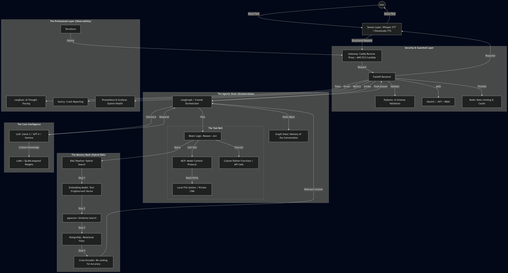

# 🌌 Nexus_AI
### *The Agentic Unstructured-to-Action Intelligence Engine*



---


---

## 🎯 Project Vision & Purpose

### The Problem: The "Dark Data" Crisis
In the modern enterprise, the most valuable knowledge is trapped in **"Dark Data"**—unstructured, fragmented files like messy PDFs, legacy spreadsheets, recorded meeting MP4s, and scattered PowerPoint decks. This data is invisible to traditional search engines and unusable for standard LLMs because it lacks structure and scale.

### The Solution: Nexus_AI
Nexus_AI is not just a chatbot; it is a **complete intelligence refinery**. The goal is to build a system that can "sense" any file format, "remember" its semantic meaning with mathematical precision, and eventually "act" on that information autonomously. 

👉 **Nexus_AI bridges between raw binary files and actionable AI intelligence.**

---

### 🛠️ The Journey So Far
Nexus_AI is engineered in modular stages to ensure production-grade stability:

- **Part 1 (The Senses):**  
  A high-performance multimodal ingestion engine that extracts signals from noise across 14+ data formats  

- **Part 2 (The Memory):**  
  A hybrid vector memory bank using `pgvector` for sub-millisecond semantic retrieval  

- **The Future (The Brain & Hands):**  
  Moving toward **Agentic Orchestration (LangGraph)**, where the system not only answers questions but executes complex workflows  
  *(e.g., “Analyze this PDF and send a summary email to the CEO”)*  

---

### 🧾 Final Result
An autonomous, end-to-end system that transforms any corporate file into a trigger for AI-driven action

---

## 🧬 Deep Dive: Engineering Implementation

---

### 🧩 Part 1: The Multimodal Ingestion Engine

The goal was to build a **"Universal Translator"** for data.

Instead of relying on simple file-extension checks, we implemented:
👉 **Binary Magic-Byte Detection using `python-magic`**

---

### 📊 Data Format Coverage

We support **14+ formats**, categorized as:

- **Documents:** PDF, DOCX, PPTX, TXT, MD  
- **Tabular:** CSV, XLSX  
- **Vision:** JPG, PNG, TIFF  
- **Media:** MP3, WAV, MP4, MKV  
- **Archives:** ZIP  

---

#### ⚠️ Challenges & Engineering Solutions
| Format | The Technical Challenge | The Engineering Solution |
| :--- | :--- | :--- |
| **PDF** | Tables are often read as jumbled text strings, losing all meaning. | Implemented a **Hybrid Approach**: `PyMuPDF` for text and `Camelot` for tabular linearization. |
| **Images** | Low contrast and noise make OCR inaccurate. | Integrated `Tesseract-OCR` with `Pillow` pre-processing to normalize images before extraction. |
| **Media** | Massive file sizes leading to RAM crashes during transcription. | Used `MoviePy` to extract raw audio streams and `OpenAI Whisper` for time-stamped, high-fidelity transcription. |
| **Office** | Data is buried in complex, nested XML schemas. | Used `python-docx` and `python-pptx` to recursively traverse the XML tree to extract structured paragraphs. |
| **Tabular** | LLMs struggle with raw comma-separated values in large files. | Used `Pandas` to convert DataFrames into **pipe-separated strings**, which preserves structural integrity for embeddings. |
| **Archives** | Recursive "Zip-Bombs" (folders inside folders). | Built a **Recursive Unpacker** using `zipfile` that feeds discovered files back into the dispatcher. |

---

### ⚙️ Why This Tech Stack?

- **`asyncio` vs Threading**  
  Used `asyncio` with a `Semaphore(5)` throttle to prevent system crashes under heavy I/O workloads  

- **`uv` vs pip**  
  Chosen for deterministic, ultra-fast dependency resolution and reproducibility  

- **`Pydantic` vs dicts**  
  Enforces strict schema validation, ensuring consistent output (`DocumentElement`) regardless of input type  

---

## 🧠 Part 2: The Hybrid Memory Bank

The goal was to design a storage system that is both:
- **Relational** (metadata handling)  
- **Semantic** (meaning representation)  

---

#### 🚀 The Technology Choice: Why PostgreSQL + pgvector?
I bypassed popular "Vector-Only" databases (like Pinecone, Milvus, or Chroma) for these specific reasons:
1. **ACID Compliance:** Corporate data requires strict consistency. Postgres ensures no data loss.
2. **Hybrid Querying:** I can filter by metadata (e.g., *"Find documents from User X in 2023"*) and perform a vector search in **one single SQL query**.
3. **Zero Vendor Lock-in:** By using an open-source extension, the system remains portable and cost-effective.
4. **Raw SQL Performance:** I used **Raw SQL** instead of an ORM (SQLAlchemy) to utilize the `<=>` (cosine distance) operator directly, reducing latency by avoiding abstraction overhead.
---

## 🛠️ Tech Stack Checklist

### ✅ Completed Modules

- [x] **Part 1: Multimodal Ingestion Engine**  
  (`PyMuPDF`, `Whisper`, `Tesseract`, `Asyncio`, `python-magic`)  

- [x] **Part 2: Hybrid Memory Bank**  
  (`PostgreSQL 16`, `pgvector`, `Sentence-Transformers`)  

---

### ⏳ Future Modules

- [ ] **Part 3: Secure API Gateway**  
  (FastAPI, JWT Auth, Rate Limiting)  

- [ ] **Part 4: Agentic Brain**  
  (LangGraph, Multi-LLM Routing, Tool Calling)  

- [ ] **Part 5: Observability Layer**  
  (Langfuse, Prometheus, Grafana)  

- [ ] **Part 6: Advanced RAG**  
  (Hybrid Search, Cross-Encoder Reranking)  

- [ ] **Part 7: MCP Integration**  
  (Model Context Protocol for tool connectivity)  

- [ ] **Part 8: Cloud Scale**  
  (Docker, Kubernetes, Terraform)  

---

## 🚀 Quick Start

### 1. System Dependencies (Ubuntu / WSL)

```bash
sudo apt update
sudo apt install postgresql postgresql-contrib build-essential git tesseract-ocr libtesseract-dev ffmpeg
```

---

### 2. Vector Database Setup

```bash
# Install pgvector
git clone --branch v0.7.0 https://github.com/pgvector/pgvector.git
cd pgvector
make
sudo make install

# Configure database
sudo -i -u postgres psql -c "CREATE USER nexus_user WITH PASSWORD 'nexus_pass';"
sudo -i -u postgres psql -c "CREATE DATABASE nexus_db OWNER nexus_user;"
sudo -i -u postgres psql -d nexus_db -c "CREATE EXTENSION vector;"
```

---

### 3. Run the Engine

```bash
# Clone repository
git clone https://github.com/your-username/Nexus_AI.git
cd Nexus_AI

# Install dependencies
uv sync

# Setup environment variables
echo "DB_HOST=localhost
DB_PORT=5432
DB_NAME=nexus_db
DB_USER=nexus_user
DB_PASS=nexus_pass" > .env

# Run pipeline
uv run run_ingestion.py
```

---

## 📖 Usage

- **Input:**  
  Drop any combination of PDF, MP4, ZIP, or DOCX files into the input directory  

- **Processing Pipeline:**  
  UnifiedIngestor → Detect MIME type → Extract content → Generate embeddings  

- **Query:**  
  Perform semantic search using the memory manager  

- **Example Query:**  
  "What are the risk factors mentioned in the financial report?"  

- **Result:**  
  Retrieves the exact paragraph from a 50-page PDF using semantic similarity  

  ## 📄 License
This project is licensed under the MIT License - see the LICENSE file for details.# Nexus_AI
